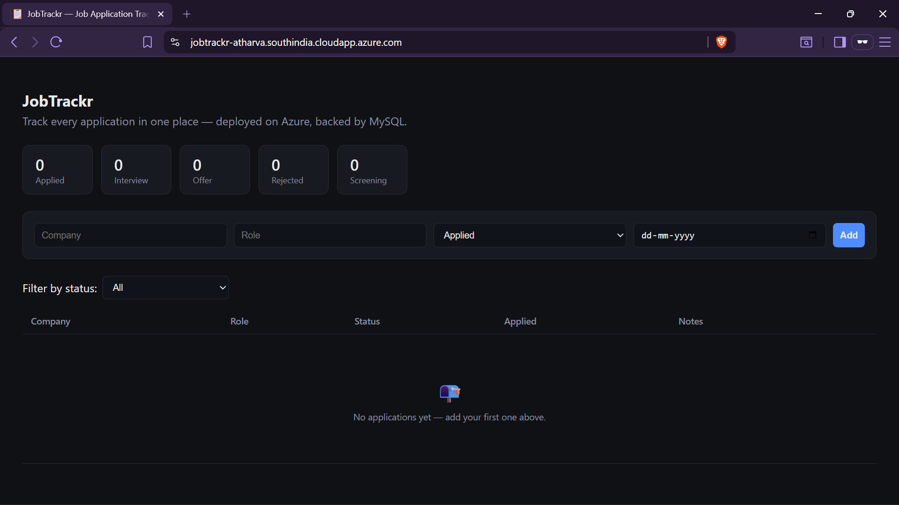
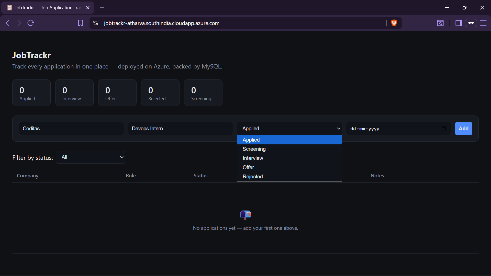
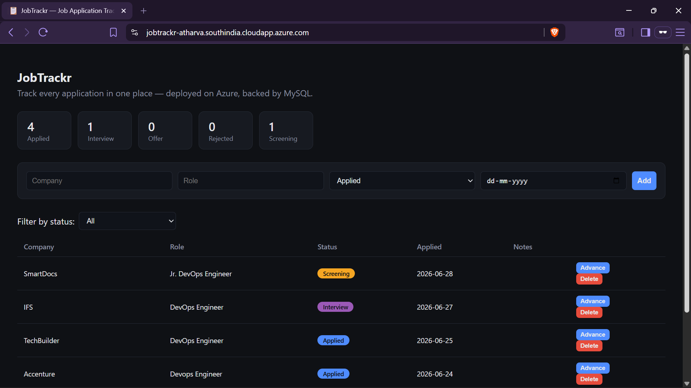
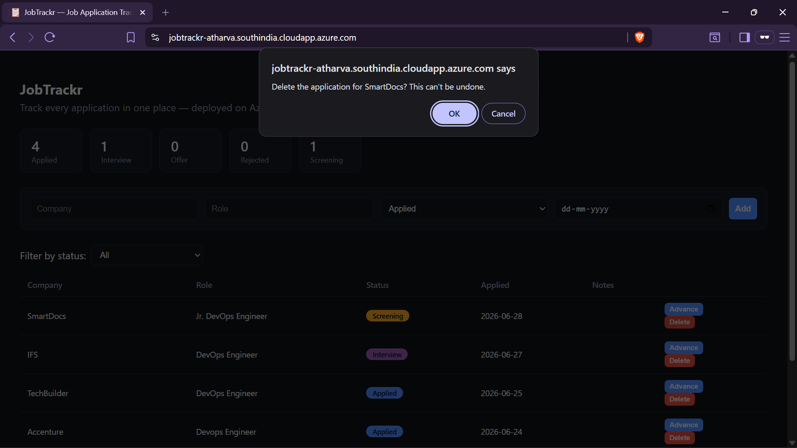
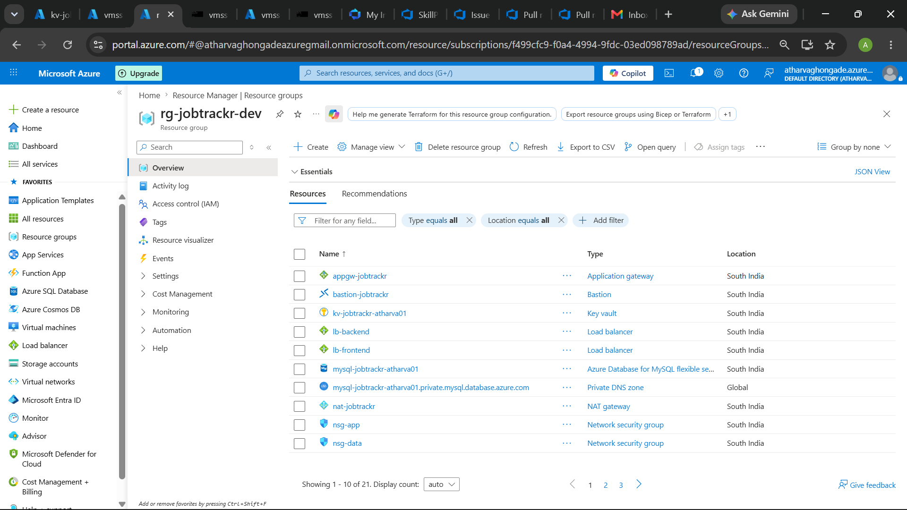
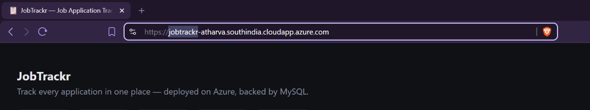
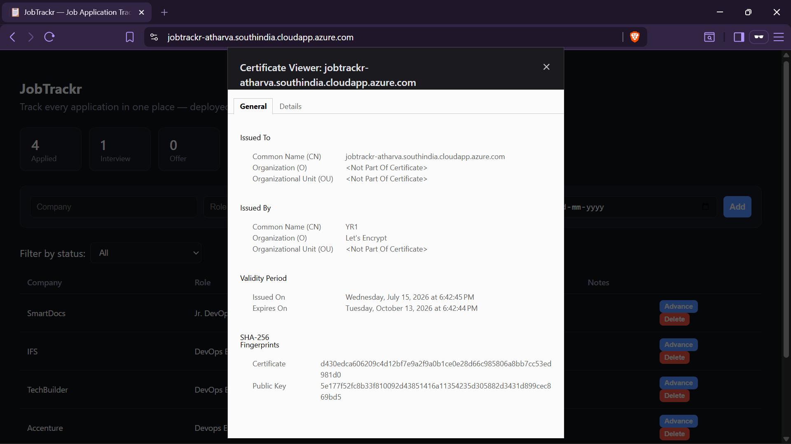

# JobTrackr

A job application tracker deployed on production-style Azure infrastructure — built as a hands-on project to learn cloud infrastructure, Infrastructure as Code, and secure deployment practices end to end.

> **Note:** The live Azure infrastructure has been intentionally decommissioned to conserve cloud credits (App Gateway + WAF is expensive to run 24/7 on a personal account). Screenshots below were taken from the live, fully working deployment before teardown.

---

## What It Does

JobTrackr is a lightweight web app for tracking job applications — add an application, move it through statuses (Applied → Screening → Interview → Offer/Rejected), and see counts at a glance. The app itself is intentionally simple; the focus of this project is **how it's deployed and secured**, not the feature set.

| | |
|---|---|
|  |  |
|  |  |

---

## Why I Built This

I'm a DevOps fresher, and I wanted to go beyond tutorials and stand up a real environment: provision cloud infrastructure with Terraform, put a real app behind a WAF with a trusted TLS certificate, manage secrets properly, and document the mistakes I made along the way — not just the polished final state.

---

## Architecture

```
                                Internet
                                    │
                                    ▼
                      ┌─────────────────────────┐
                      │   Azure App Gateway      │
                      │   (WAF + Let's Encrypt   │
                      │    TLS termination)      │
                      └────────────┬─────────────┘
                                   │
                                   ▼
                      ┌─────────────────────────┐
                      │  Internal LB (frontend)  │
                      └────────────┬─────────────┘
                                   ▼
                      ┌─────────────────────────┐
                      │  VMSS – Frontend         │
                      │  (Nginx, static site)    │
                      └────────────┬─────────────┘
                                   ▼
                      ┌─────────────────────────┐
                      │  Internal LB (backend)   │
                      └────────────┬─────────────┘
                                   ▼
                      ┌─────────────────────────┐
                      │  VMSS – Backend          │
                      │  (Python API server)     │
                      └────────────┬─────────────┘
                                   │
                     ┌─────────────┴─────────────┐
                     ▼                            ▼
          ┌───────────────────┐       ┌────────────────────┐
          │  Azure Key Vault   │       │  Azure MySQL        │
          │  (secrets, no      │       │  Flexible Server    │
          │   creds in code)   │       │  (private DNS zone) │
          └───────────────────┘       └────────────────────┘

    NAT Gateway → outbound internet for VMs with no public IP
    NSGs (nsg-app, nsg-data) → network-level segmentation
    Azure Bastion → no public SSH; native-client tunneling for
                     secure file transfer (scp)
```

All of the above is provisioned and torn down with Terraform — nothing was clicked together manually in the Portal.



---

## Tech Stack

**Application**
- Backend: Python (REST API)
- Database: MySQL (Azure MySQL Flexible Server)
- Frontend: HTML/CSS/JavaScript, served by Nginx
- Containerization: Docker

**Infrastructure / DevOps**
- **Terraform** — full IaC for all Azure resources (48 resources provisioned in a single `apply`)
- **Azure VM Scale Sets (VMSS)** — separate scale sets for frontend and backend
- **Azure Application Gateway** — Layer 7 load balancer + Web Application Firewall (WAF) + TLS termination
- **Internal Load Balancers** — distribute traffic to VMSS instances (frontend and backend tiers)
- **Azure NAT Gateway** — outbound internet access for VMs without public IPs
- **Network Security Groups** — segmented rules for app tier and data tier
- **Azure Key Vault** — centralized secret storage (DB credentials, init secrets)
- **Azure MySQL Flexible Server** — managed database, private DNS zone
- **Azure Bastion** — secure, no-public-IP access to VMs, native client tunneling for scp
- **Let's Encrypt / Certbot** — free, trusted TLS certificates (webroot validation)
- **GitHub** — version control, `.gitignore`-enforced secret hygiene

---

## HTTPS / TLS

The app is served over a trusted certificate (not self-signed) — issued by Let's Encrypt and terminated at App Gateway.

| | |
|---|---|
|  |  |

---

## Key Infrastructure Decisions & Challenges

Two problems came up during the build that were worth solving properly rather than working around:

**1. Certbot standalone mode failed behind App Gateway.**
Standalone validation needs to bind port 80 directly, but public traffic hits App Gateway first, not the VM — so Let's Encrypt's validation requests never reached the temporary server certbot spun up, and the request timed out. Fixed by switching to **webroot mode**, which drops the ACME challenge file into the path Nginx already serves, so the existing request path (Internet → App Gateway → Nginx) handles validation with zero downtime and no port conflicts.

**2. Manual Azure CLI changes were silently reverted by Terraform.**
I enabled Bastion's native client tunneling directly via `az` CLI to unblock a file transfer, but the next `terraform plan` flagged it as drift and would have reverted it on the next apply — because it wasn't defined in the `.tf` files. Fixed by codifying `tunneling_enabled = true` directly in `bastion.tf`, closing the gap between live state and declared state. **Lesson: any manual change to Terraform-managed infrastructure is temporary unless it's written back into code.**

A related issue with Key Vault secrets (manually added secrets got wiped on a `destroy`/`apply` cycle since they weren't Terraform-managed) reinforced the same lesson from a different angle — see [Future Improvements](#future-improvements).

---

## Security Practices Followed

- No secrets committed to git — enforced via `.gitignore` (`*.pfx`, `*.pem`, `*.tfstate`, etc.)
- `terraform.tfstate` (which can contain plaintext secrets) removed from version control
- Database and VMs have no direct public exposure — access only via Bastion, segmented by NSGs
- TLS termination at App Gateway with a WAF in front of the application
- Secrets pulled from Key Vault at boot time, not hardcoded into app config

---

## Infrastructure as Code in Action

```
Apply complete! Resources: 48 added, 0 changed, 0 destroyed.

Outputs:
appgateway_public_ip = "74.224.92.7"
bastion_name         = "bastion-jobtrackr"
key_vault_name       = "kv-jobtrackr-atharva01"
mysql_server_fdqn    = "mysql-jobtrackr-atharva01.mysql.database.azure.com"
resource_group_name  = "rg-jobtrackr-dev"
```
*(See full terminal output: [`screenshots/08-terraform-apply-output.png`](screenshots/08-terraform-apply-output.png))*

---

## Setup / Deployment

```bash
# Clone the repo
git clone https://github.com/AtharvaGhongade/JobTracker.git
cd jobtrackr-app/terraform

# Provision infrastructure
terraform init
terraform plan
terraform apply

# Secrets (Key Vault) are not Terraform-managed in this version —
# see Future Improvements. Add manually via:
az keyvault secret set --vault-name <vault-name> --name mysql-admin-password --value "<value>"
az keyvault secret set --vault-name <vault-name> --name mysql-host --value "<value>"
az keyvault secret set --vault-name <vault-name> --name init-db-secret --value "<value>"
```

---

## Future Improvements

- **Terraform-manage Key Vault secrets** (`azurerm_key_vault_secret` resources) so they survive `destroy`/`apply` cycles instead of requiring manual re-entry via Cloud Shell.
- **Move Key Vault networking from fully private to public + RBAC-gated**, so CI/CD or automated secret seeding doesn't require a manual network toggle.
- Add a CI/CD pipeline (GitHub Actions) to automate `terraform plan`/`apply` on merge.
- Automate certificate renewal (Let's Encrypt certs expire every 90 days — currently a manual re-run).

---

## Author

Atharva Ghongade — DevOps enthusiast, learning by building and breaking things (and documenting the breaking).
